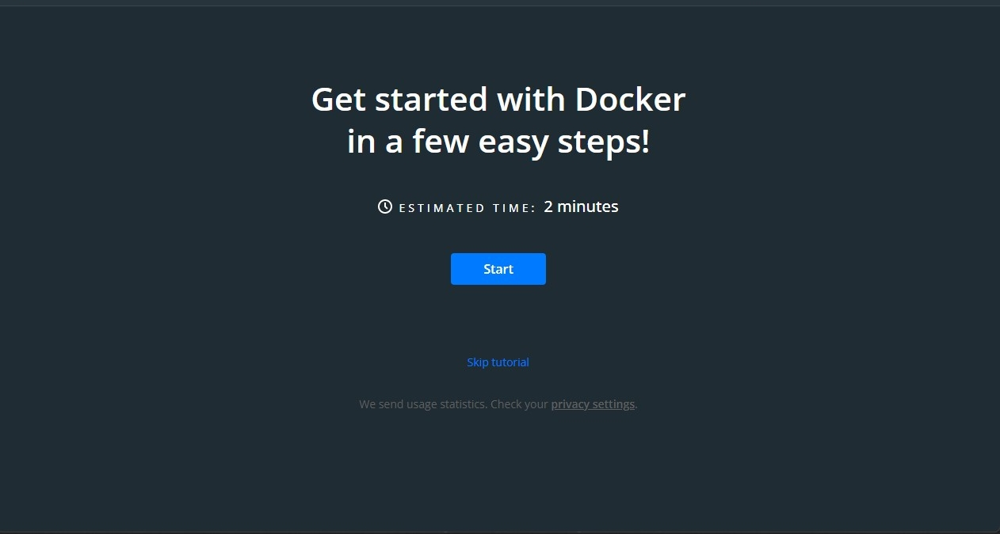

<!-- vscode-markdown-toc-config
	numbering=true
	autoSave=true
	/vscode-markdown-toc-config -->
<!-- /vscode-markdown-toc -->

# Instalación de Docker Desktop en Windows
Manual de instalación de Docker Desktop para Windows.

##  1. Tabla de Contenido 
* 1. [Prerequisitos](#Prerequisitos)
	* 1.1. [Verificar versión de Windows](#VerificarVersionWindows)
	* 1.2. [Verificar el estado de la virsualización en Windows](#VerificarVirtualizacionWindows)
	* 1.3. [Verificar por cual método instalar Docker Desktop](#VerificarMetodo)

* 2. [Instalar en versiones antiguas (7, 8 y 10 home)](#VersionAntigua)
	* 2.1. [Descargar el instalador Docker ToolBox](#DockerToolBox)
	* 2.2. [Ejecutar el instalador](#EjecutarInstalador)
    * 2.3. [Ejecutar Docekr Quickstart](#VerificarversindeWindowsows)
	
* 3. [Instalar en versiones más recientes](#VersionReciente)
    * 3.1 [Pasos para instalación con WSL-2](#InstalacionWSL)
    * 3.2 [Pasos para instalación con Hyper-V](#InstalacionHyper-V)
	* 3.3 [Crear una cuenta en Docker Hub](#DockerHub)
    * 3.4 [Instalar Docker Desktop for Windows](#DescargarEInstalarDockerForWindows)
    * 3.5 [Configurar Docker Desktop](#ConfigDockerDesktop)
* 4. [Referencias](#Referencias)

##  2. Prerequisitos
Primeramente debemos tener nociones sobre nuestro sistema operativo, la versión y el build que posee, así cómo conocer si tiene habilitada la opción de virtualización.

###  2.1. Verificar versión de Windows
Las instalaciones son diferentes entre Windows Pro Edition y Windows Home Edition, ya que Windows Home no incluye la función Hyper-V (necesaria para ejecutar "Docker for Windows").

1. Ejecutar **win + R**
   

    
   

2. Escribir el comando **msinfo32** en la ventana que se abre (Ejecutar)
   

    
   

3. Verificar la información de:
    * Nombre del SO
    * Versión
    * Tipo de Sistema (Arquitectura)
    * Mememoria física Instalada (RAM)
    

     
    

###  2.2. Verificar el estado de la virtualización en Windows
Ahora debemos verificar información respecto a la virtualización, especificamente debes ver si nuestro sistema operativo tiene habilitada la virtualización. Para comprobar esto, sigue los siguientes pasos. 

1. Ejecutar **win + R**
   

    
   

2. Escribir el comando **taskmgr** en la ventana que se abre (Ejecutar)
   

    
   

3. Se abrirá el administrador de tareas, aquí debemos dirigirnos a la pestaña de *Performance* o *rendimiento*.
   

    
   

4. Posteriormente, aquí vamos a comprobar si la virtualización está habilitada o no. Así cómo se muestra en la imagen, en mi caso está habilitada. 
   

    
   

**NOTA:** Si no tienes habilitada la virtualización, te sugiero buscar un tutorial para activarlo, debido a que los métodos para activarla varia dependiendo del equipo, es decir, dependiendo del modelo y marca de la computadora. 

###  2.2. Verificar por cual método instalar Docker Desktop

Ahora ya conocemos la información de nuestro sistema operativo, esto nos dará la pauta para poder evaluar si cumplimos con lo necesario para instalar Docker Desktop, así mismo para definir que método utilizar. Las condiciones que debemos tener son las que se presentan en la siguiente tabla. 

| Sistema Operativo     | Arquitectura | Build        | Método                     | Apto |
| --------------------- | ------------ | ------------ | -------------------------- | ---- |
| Windows 10 Home       | 64 bits      | 21H2 o mayor | Docker Desktop for Windows | ✅    |
| Windows 10 Pro        | 64 bits      | 21H2 o mayor | Docker Desktop for Windows | ✅    |
| Windows 10 Education  | 64 bits      | 21H2 o mayor | Docker Desktop for Windows | ✅    |
| Windows 10 Enterprise | 64 bits      | 21H2 o mayor | Docker Desktop for Windows | ✅    |
| Windows 10 Home       | 32 bits      | Cualquiera   | Ninguno                    | ❌    |
| Windows 10 Pro        | 32 bits      | Cualquiera   | Ninguno                    | ❌    |
| Windows 10 Education  | 32 bits      | Cualquiera   | Ninguno                    | ❌    |
| Windows 10 Enterprise | 32 bits      | Cualquiera   | Ninguno                    | ❌    |
| Windows 11 Home       | 64 bits      | 21H2 o mayor | Docker Desktop for Windows | ✅    |
| Windows 11 Pro        | 64 bits      | 21H2 o mayor | Docker Desktop for Windows | ✅    |
| Windows 11 Education  | 64 bits      | 21H2 o mayor | Docker Desktop for Windows | ✅    |
| Windows 11 Enterprise | 64 bits      | 21H2 o mayor | Docker Desktop for Windows | ✅    |
| Windows 11 Home       | 32 bits      | Cualquiera   | Ninguno                    | ❌    |
| Windows 11 Pro        | 32 bits      | Cualquiera   | Ninguno                    | ❌    |
| Windows 11 Education  | 32 bits      | Cualquiera   | Ninguno                    | ❌    |
| Windows 11 Enterprise | 32 bits      | Cualquiera   | Ninguno                    | ❌    |
| Windows 8             | 64 bits      | Cualquiera   | Docker  ToolBox            | ✅    |
| Windows 8.1           | 64 bits      | Cualquiera   | Docker  ToolBox            | ✅    |
| Windows 7             | 64 bits      | Cualquiera   | Docker  ToolBox            | ✅    |

De acuerdo con la documentación, el requisito fundamnetal es que la arquitectura de la computadora sea de 64 bits, por lo que se desonoce si funcione en una arquitectura de 32 bits, lo más probable es que no.
**Nota:** Actualizaré el repositorio si tuviera información de versiones en las que si se les puede instalar.

##  3. Instalar en versiones antiguas (7, 8 y 10 home)
A continuación se describen los pasos a realizar para la instalación de Docker Desktop en versines antiguas de Windows. 
Así cómo lo menciona la documentación oficial de Docker. este método es poco garantizado, debido a que el soporte para estas versiones del sistema operativo quedó descontinuado desde el 2019, por lo que programa a instalar es con la última versión de dicho año.

[Documentación ofical de Docker](https://docs.docker.com/toolbox/)

###  3.1. Descargar el instalador Docker ToolBox
Los primero es descargar el siguiente instalador. Para garantizar que es de confianza, se descarga del reposiotario oficial.  

 <a href="https://github.com/docker-archive/toolbox/releases/tag/v19.03.1">Docker Toolbox Código (GitHub).
 </a>

 <a href="https://github.com/docker-archive/toolbox/releases/download/v19.03.1/DockerToolbox-19.03.1.exe">Docker Toolbox Instalador.
 </a>

¿Qué contiene este programa?
* Docker
  
  Los binarios de Docker están disponibles para crear y ejecutar contenedores en su computadora. Al instalar Docker, obtiene una CLI de Docker para comunicarse con un servidor Docker. De esta manera, puede lanzar instrucciones y se ejecutarán en sus contenedores.
* Docker-Machine
  
  Una herramienta que maneja el aprovisionamiento en sus contenedores (instalación de paquetes, eliminación de paquetes, ejecución, etc.).

* Docker-Compose
  
  Una herramienta para entornos que contienen múltiples contenedores con diferentes entornos. De esta forma, puede iniciar varios contenedores juntos o detenerlos juntos.
  
* Kitermatic
  
  Una dulce interfaz gráfica para que controle sus contenedores en Windows y Mac.

* Boot2Docker ISO

  Una pequeña distribución de Linux para ejecutar Docker en Windows.

* VirtualBox

  Hipervisor de código abierto para Windows y se utiliza para emular sistemas operativos en su sistema Windows.

###  3.2. Ejecutar el instalador
Una vez descargado, lo que se procede a realizar es ejecutar el intalador.

1.- Ejecutamos el instalador. Y se nos abrirá una ventana cómo la siguiente. Solo debemos dar clic en el botón de *next*. 
   

    
   

2.- Ahora vamos a seleccionar la ubicación en donde se instalará el programa. Podemos dejar la que nos da por default o escribir una ruta que deseemos. 
   

    
   

3.- Procedemos a seleccionar las herramientas que deseemos, les recomiendo dejar todas las que vienen seleccionadas por default. Entonces simplemente damos clic en el botón de *next*.
   

    
   

4.- Ahora seleccionamos los accesos directos que deseamos y la opción de agregar el path, recomiendo dejar las opciones seleccionadas por default. Luego damos clic en el botón de *next*.
   

    
   

5.- Revisamos que vamos a instalar lo correcto, desde la ubicación que deseamos, los accesos directos y los componentes. Una vez que todo está correcto, procedemos a dar clic en *instalar* y se empezará a instalar el programa.
   

    
   

6.- El tiempo de instalación dependerá de su computadora pero suele durar entre 10 a 20 minutos.
   

    
   

7.- Si al momento de instalar les sale que deben instalar un software, simplemente dan en la opción de *Instalar*.
   

    
   

8.- Una vez terminada la instalación, en la última ventana vamos a dar clic en *Finish*.
   

    
   

8.- Se nos abrirá el explorar de archivos, y ahí vamos a observar nuestros accesos directos. Con esto logramos garatnizar que hemos instalador correctamente Docker.
   

    
   

###  3.3. Ejecutar Docker Quickstart
Ahora que Docker está instalado, procedemos a ejecutar el proceso de Docker Quickstart.
1. Ejecutamos el acceso directo denomiado *Docker Quickstart*. 
2. Se nos abrirá una ventana con la ejecución de un inicio rápido en Docker.

##  4. Instalar en versiones recientes
A continuación se describen los pasos a realizar para la instalación de Docker Desktop en versines recientes de Windows. 
Hay dos formas de realizar la instalación, la primera forma es con WSL-2 y la otra con Hyper-V. Aunque recomendaría realizar ambos procesos para aprovecahr mejor el rendimiento de Docker Desktop. 
###  4.1. Instalación WSL-2
A continuación se presenta el manual donde se detallan los pasos a seguir para tener el ambiente de WSL-2 listo para la instalación de Docker Desktop.

 <a href="./wsl2.md">Munual de WSL-2.
 </a>

###  4.2. Instalación Hyper-V
A continuación se presenta el manual donde se detallan los pasos a seguir para tener el ambiente de Hyper-V listo para la instalación de Docker Desktop.

 <a href="./hyper-v.md">Munual de Hyper-V.
 </a>

###  4.3. Crear una cuenta en Docker Hub
A continuación se presentarán los pasos a seguir para poder crear una cuenta de Docker Hub, esto con la finalidad de poder aprovechar las ventajas que nos da Docker Desktop para los usuarios que no son anonimos (Con ID de Docker Hub). 

Alguna de las ventajas son: 
* Obtener el doble de pulls (200) cada 6 horas, en comparación de un usuario anonimo. 
* Poder implementar una gestión de acceso. 
* Acceso a solo contenido de confianza. 
* Mayor seguridad en general. 

1. Acceder al portal de [Docker Hub](https://hub.docker.com/). Y dirigirse a la opción de **sign up**.
   

    
   

2. Proceder a rellenar los campos que solicita, para crearse una cuenta. Luego acceder al correo que registremos y activar la cuenta. 
   

    
   

3. Luego acceder al login para loguearse. 
   

    
   

4. Colocar nuestro usuario o nuestro emial y nuestra respectiva contraseña para acceder. 
   

    
   

5. Al acceder, podemos verificar que ya tenemos nuestra cuenta de Docker Hub, ahora este usuario lo vamos a utilizar para acceder a Docker Desktop. 
   

    
   

###  4.4. Descargar e Instalar Docker Desktop for Windows

Ahora, vamos a proceder a descargar el instalador *Desktop for Windows* para proceder con la instalación cómo tal del programa Docker Desktop.
1. Descargar el instalador del siguiente enlace. 
   

    <a href="https://desktop.docker.com/win/main/amd64/Docker%20Desktop%20Installer.exe"> Instalador Desktop for Windows </a>
   

2. Ejecutar el instalador descargado. Entonces se nos abrirá el instalador y automaticamente empezará a descargar los archivos necesarios para la instalación.
   

    
   

3. Luego de que termine de descargar algunos archivos, nos saldrá la siguiente ventana y en esta debemos seleccionar las dos opciones. Donde la primera son componentes para WSL-2 y la segunda es para agregar una acceso directo. Luego debemos dar clic en el botón *Ok*.
   

    
   

4. Se empezará a desempaquetar los diferentes archivos descargados, este proceso varia dependiende los recursos de tu computadora pero entre 5 a 10 minutos.
   

    
   

5. Una vez que se termine el proceso anterior. Se nos mostrará una ventana cómo la siguiente, donde debemos dar clic en el botón *Close*. También les puede salir un botón con la opción *Close and logout*, igual le da clic, y lo que hará es cerrarle la sesión de su usuario de Windows.
   

    
   

6. Si nos dirigimos a nuestro escritorio, vamos a ver un icono cómo el siguiente, este es un acceso directo para ejecutar **Docker Desktop**. Le damos clic en él para proceder a abrir el programa.
   

    
   

7. Al abrir Docker Desktop por pirmera vez, nos mostrará una ventana con la licencia del programa, lo que debemos hacer leer toda la licencia y luego dar clic en el botón *Accept*.
   

    
   

Y listo, tendríamos instalado Docker Desktop para poder utilizarlo. 
###  4.4. Configurar Docker Desktop
1. Al iniciar por primer vez el programa, vamos a ver una ventana cómo la siguiente.
   Podemos seguir el tutorial que nos muestra o podemos saltarnos esta parte.
   

    
   

2. Al terminar de completar el tutorial o de saltarse el paso, vamos a ver una ventana cómo la siguiente en la que nos muestra cómo podemos ejecutar un comando de Docker.
   

    
   

3. En la parte superior, aparece la opción para poder iniciar sesión con nuestro usuario de Doker Hub. En mi caso ya estoy logueado, pero es fácil este procedimiento, además que obtenemos más ventajas al realizarlo.
   

    
   

Listo, ya tenemos Docker Desktop instalado y preparado para poder empezar a utiliarlo, para gestionar nuestras imagenes, volumenes y contenedores de Docker.

##  5. Referencias
Esta pequeña guía fue elaborada en base a la documentación oficial de Docker y Microsoft. 

* [Instalación de Docker en Windows](https://docs.docker.com/desktop/windows/install/).
* [Problemas al instalar Docker](https://docs.docker.com/desktop/windows/troubleshoot/).
* [Manual de usuario de Docker](https://docs.docker.com/desktop/windows/).
