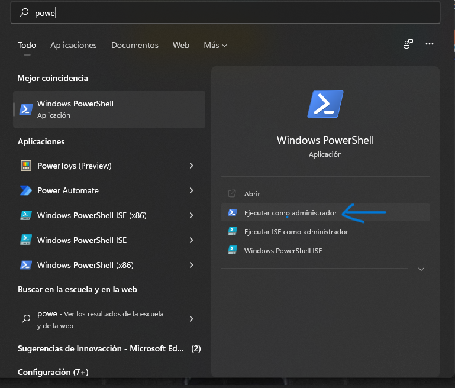

# INSTALACIÓN Hyper-V
## Requerimientos
* Es importante aclarar que para poder instalar WSL-2 debemos cumplir con los prerequisitos explicados en el tutorial principal.
* Solo se puede habilitar en Windows 10 Enterprise, Pro, o Education.

**Requerimientos de Hardware:**

Aunque este documento no proporciona una lista completa del hardware compatible con Hyper-V, los siguientes elementos son necesarios:
* Procesador de 64 bits con traducción de direcciones de segundo nivel (SLAT).
* Soporte de CPU para VM Monitor Mode Extension (VT-x en CPU Intel).
* Mínimo de 4 GB de memoria. Dado que las máquinas virtuales comparten memoria con el host de Hyper-V, deberá proporcionar suficiente memoria para manejar la carga de trabajo virtual esperada.

## Procedimiento

1. Vamos a buscar la *Power Shell* y la ejecutamos cómo administrador. 
   <p align="center">
    
   </p>
   
2. Ahora vamos a instalar WSL de forma general. Para ello escribimos el comando **wsl --install**.

  ```bash
  Enable-WindowsOptionalFeature -Online -FeatureName Microsoft-Hyper-V -All
  ```
3. Reiniciamos la computadora.
4. Ahora, podemos comprobarlo si lo tenemos activado. Para ello vamos a hacer clic derecho en el botón de Windows y seleccionamos *Aplicaciones y características*.
5. Seleccionamos *Programas y características* a la derecha debajo de la configuración relacionada.
6. Seleccionamos *Activar o desactivar las funciones de Windows*.
7. Seleccionamos *Hyper-V* y luego clic en Aceptar.
   <p align="center">
    
   </p> 
8. Reiniciamos la computadora.

## Referencias
Para mayor información pueden visitar la documentación oficial de Microsoft [aquí](https://docs.microsoft.com/en-us/virtualization/hyper-v-on-windows/quick-start/enable-hyper-v).
