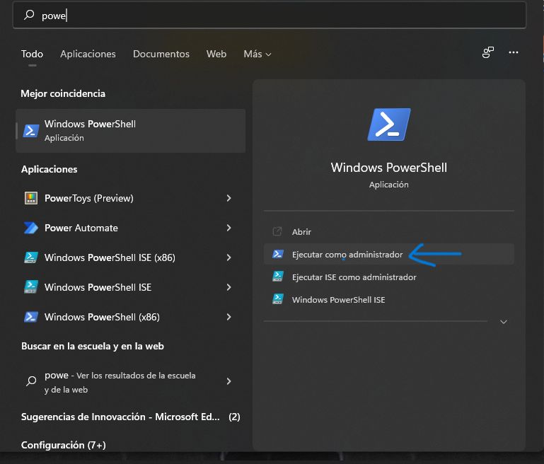
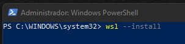
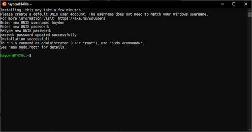

# INSTALACIÓN WSL - 2 
Es importante aclarar que para poder instalar WSL-2 debemos cumplir con los prerequisitos explicados en el [tutorial princiapl](https://github.com/ChepeAicrag/Instalacion-Docker-Desktop#Prerequisitos).
  
1. Vamos a buscar la *Power Shell* y la ejecutamos cómo administrador. 
   <p align="center">
    
   </p>
   
3. Ahora vamos a instalar WSL de forma general. Para ello escribimos el comando **wsl --install**.

  ```bash
  wsl --install
  ```
  
El comando anterior va a descargar los paquetes necesarios para instalar WSL en nuestra computadora. Además de acuerdo con la documentación este comando habilitará los    componentes opcionales requeridos, descargará el kernel de Linux más reciente, establecerá WSL 2 como predeterminado e instalará una distribución de Linux para usted (Ubuntu de manera predeterminada, vea a continuación para cambiar esto).
   <p align="center">
    
   </p> 

4. Reiniciamos la computadora. 
5. Y al volver a iniciar sesión, vamos a visualizar una ventana cómo la que se muestra en la imagen. 
   <p align="center">
    
   </p> 
6. Ejecutamos nuevamente *Power Shell* como administrador.
7. Ahora ejecutamos el comando **wsl --set-default-version 2**. Y con este comando vamos a poder utilizar WSL con la versión 2, es decir, a WSL-2.
  ```bash
  wsl --set-default-version 2
  ```
Y listo, con esos pasos tenemos instalado WSL-2. 


Para más información puedes visitar el manual oficial de Microsoft [aquí](https://docs.microsoft.com/en-us/windows/wsl/install). 
